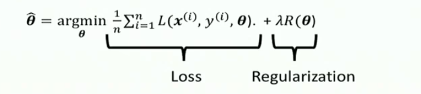
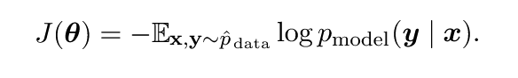
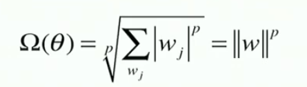
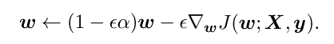

# Advanced machine learning

## Deep learning

Framework of artificial intelligence, is a subset of machine learning.
Solve tasks easy for humans but difficult to machines.
Acquire knowledge by extracting patterns from data.
In machine learning the difference between traditional programming is that we obtain the set of rules by combining the input and the output.

### Feature representation

Representation is foundamental and many artificial intelligence tasks can be solved by designing the right set of features. But is difficult to know wich features should be extracted.

The solution is to use machine learning not only to find the mapping between input and output but also to find the representation itself. This approach is called representation learning. The quintessential example of a representation learning algorithm is the autoencoder.

### Representation learning

The goal is to identify the **factor of variations** that explains the observed data(they might not be directly observable)
They might be seen as concepts or abstractions that help us make sense of the rich **variability** in the data.

### Deep learning

Deep learning solves this central problem in representation learning by introducing representations that are expressed in terms of others.
It understands concepts by low-mid and high level features.
Deep learning are complicated function mappings, combining simpler mappings. Depth of a model consist in the depth of the graph describing how concepts are related to each other or in terms of number of sequential instructions that must be executed to evaluate the architecture)How to compute output given the input.

## Feed forward neural network

The goal of this model is to leatn to approximate some function f. A FFN defined a mapping $y=f(x,\Theta)$ and learns the value of the parameters $\Theta$ that result in the best function approximation.Feed forward because the information flows through the function being evaluated from x, through the intermediate computation used to define f and finally to the output y.
To train a neural network we compare the output with the correct data, and then we propagate back the errors. We need to make changes that reduce the errors.

## XOR problem

With a linear regression we cannot solve the xor problem, because can't divide weel the result space. The solution space is not linearly separable. We can solve it adding an hidden layer for the neural network.

## Kernel trick

Kernel model is for example the Support Vector Machine.
Similar to a logistic regression, is driven by a linear function.
It predicts the positive and negative class.
Is based by Basis Expansion, in other words it adds a dimension to the initial data in order to make the data linearly separable. This transformation is made by using functions to transform the data. The transformation is the _Kernel_
Operations in higher dimensions can be computationally expensive. The Kernel Trick allows to operate in the original feature space without computing the coordinates of the data in a higher dimensional space.
It allows to learn non linear models, using convex optimization. The most commonly used kerne il the Gaussian Kernel. We map n dimensiona features into m dimensional space, until they are separated.

## Gradient based optimization

Neural networks are non linear so the function to optimize become non convex. We can train theese networks with iterative gradient based optimization algorithms

### Stochastic gradient descent

In this case we use stocastic gradient descent to optimize.
Consists in minimizing the objective function, or cost or error function.
With multiple inputs we use partial derivatives. The extreme points are the points where the gradient is equal to zero. We can approximate the gradient in order to optimize a model. We don't find the exact gradient descent but we use a learning rate.

## Regularization

In order to prevent overfitting with optimization we add regularization. We add soft restrictions for the solutions. They are constraints

If lambda parameter is low, you are prone to regularization, else you have a high variance.

## Stochastic gradient descent

We calculate the gradient by one training example and we multiply by the learning rate. We can use mini batch of samples. We choose m number of example and we compute the gradient using this batch of examples and making the mean of it. We can parallelize this algorithm. The model update does not depend on the dataset size.

## Loss functions

In most cases our parametric model defines a probabilistic distribution of scores(labels).
The _negative log likeelihood_ measures the dissimilarity between the true label distribution y and the prediction $\hat{y}$. This can be written as the cross entropy between the training data and the model distribution. We use cross entropy functions because with normal distributed function the mean squared error make very small changes in the gradient. I need a function that make a good guide for the algorithm. Exponential functions saturate very quickly. Using mean squared error we predict the mean and with mean absolute error we predict the median.

Most neural networks are trained using maximum likelihood. In this case the cost function is simply yhe negative lo-likelihood, which is the cross entropy between the training data anf the model distribution

The shape of the cost function changes from model to model, depending on the form of $log p_{model}$.
The gradient of the cost function needs to be large and predictable enough to serve as good guide for the learning algorithm. Functions that satura(become very flat) are not good for this objective, because the make the gradient become very small.

### Softmax

Outputs into a vector representing a probability distribution.

### Negative log-likelyhood

is a good loss function if you have a small number of classes.

## Output units

The choice of cost function is linked with the type of output we want.
We use linear units for Gaussian Output Distributions. It simply performs a linear transformation.Linear output layers are often used to produce the mean of a conditional
Gaussian distribution
We use Sigmoid Units for Bernoulli Output Distributions.
Is used in classification problems with two classes. We use sigmoid instead the basic function based on threshold values in order to obtain gradient always different than 0. It only saturates when (1-2y)z is very negative, so when z has the wrong sign we can take the absolute value of z

### Softmax Units for Multinoulli Output Distributions

This is a generalization of the sigmoid function. They are rarely used as activation functions of hidden layers. Problem of winner takes it all, even if the classifier can't detect the class of the input one of the outputs will be the winner, leading to wrong classification in case of unseen data, so we should also add a class of "don't know elements".

## Backpropagation algorithm

Is not a training algorithm. Procedure used to estimate gradient.
Is used to compute the gradient in a simple and inexpensive procedure.
It is not the whole learning algorithm. The stochastic gradient descent is used to perform learning using the gradient.

## Hidden layers

We can use hyerbolic Tangent as hidden layer activation. Is used for classification. The gradient is bigger than the sigmoid, although is very similar.

### Rectifier linear units

very useful as default choiche. Right derivative is 0, left derivative is 1. Is non linear but has the property of linear functions. It does not activate all the neurons at the same time.
There are also absolute value rectifications, leaky relu, parametric relu, and maxout units.

## Regularization

Regularization aims to make the model perform well not only on the training data but also on real data.In the context of deep learning, most regularization strategies are based on
regularizing estimators. Increase bias to reduce variance
You can introduce reg. directly by using prior knowledge or express genereic preferences: you can change constrainst, put restrictions or change the Obj funct by adding soft constraints to penalize certain values of the parameters.
You can introduce indirectly: Using data set augmentation, or introducing noise in the training data.
We can add reg during the inference phase, ensemble methods.
Most reg strategies are based on regularizing estimators, reducing variance at the expense of increasing the bias of the estimator. Good reg decrease the variance without increasing bias too much

### Parameters norms penalties

It limits the capacity of the model by adding a penalty to the objective function, resulting in $$\hat{J} = J(\Theta; X, y)+ \alpha \Omega(\Theta)$$
alpha is an hyperparameter that weights the relative constribution of the norm penalty to the value of the objective function. It may change for each layer. If alpha is too high I fail to optimize the training, underfitting, alpha too low overfitting. We ewgularize only the weights w.
I can also have different alpha for each different layer
I can have different options fot the regularization function $\Omega$:
sum of the weights, or sum of the squared weights.The first will push all the values to 0 penalizing small weights more, the second penalize large values more.

A more general function is the p norm

### L2 Parameter Regularization

Commonly known as weight decay. This strategy drives the ewights closer to the origin by adding a regularization term $\frac{1}{2}||w||^2$ to the objective function. Is also known as ridge regression. If we compute the gradient of the function w.r.t the w variable, and apply a step of gradient descent, we can see that the parameters are shrinked by the regularization each time, and by a costant factor.

### L1 Regularization

Is defined as $$\Omega(\Theta) = ||w||_1= \Sigma_i |w_i|$$.
If we derive the regularized objective function the regularization therm is simply the alpha coefficient mulpiplied by the sign of the w variable
This type of regularization has two outcomes:

- It pushes the weights to zero
- It shift the weight value by a distance equal to $\frac{\alpha}{H_{i,i}}$

This solution is more sparse, some parameters have an optimal value of 0. This can be used as a type of feature selection mechanism

### Norm Penalties as Constrained Optimization

We may want to have the regularization function(L1,L2, etc) to be less than some costant k. The alpha parameter must increase whenever RegF > k or decrease in the opposite case. We can modify stochastic gradient descent in order to take a spet downhill on J and then project Theta back to the nearest point that satisties the costraint of the regF < k, this case consists in using explicit constraints rather than using penalties. A good reason to use explicit constraints and reprojection is that penalties can cause non convex optimization procedures to get stuck in local minima corrisponding to small $\theta$. This explicit constraints strategy don't force the weights to the origin but it have effect only when the weights become large and try to escape the constraint region, and finally they impose stability on the optimization tecnique

### Dataset augmentation

Consists in creating fake data and add it to the training data set. For classification tasks is very easy to do, we can just simply transform our data from the training set x, add some noise, and add the corresponding label y. Very useful for object recognition: we can translate, rotate, add noise to images very easily in order to improve generalization.
In neural networks we can add noise to the inputs and event to the hidden units of the network. Dropout can be seen as a method of multiplying the noise. Augmenting dataset can lead to reduce generalization error.

### Multi task learning

Is a way to improve generalization by pooling the examples(which can be seen as soft constraints imposed on the parameters) arising out of several tasks. This tipe of models share a fixed part of the parameters, used in all the tasks, and then there are task-specific parameters(which only benefit from the examples of their tasks to achieve good generalization). Improved generalization can be achieved because of the shared parameters. This will happen only if some assumptions about the statistical relationships between the different tasks are valid.

### Early stopping

Maintains the performance on the validation set, monitoring the loss of it, we maintain the configuration with the best validation loss.
This prevents overfitting
We can exploit the validation data retraining the model using all of the data up to the point that was determined during early stopping
We can Also continue training with the parameters determined by early stopping, using the validation set data: This avoid high cost of retraining from scratch.

Book:
When training large models with sufficient representational capacity to overfit
the task, we often observe that training error decreases steadily over time, but
validation set error begins to rise again. In this case we can choose to return to the point where the parameters lead to a lower validation error. Every time the error on the validation set improves we store a copy of the model parameters. When the training stops we return to the best parameters instead of the last parameters obtained. The training terminates when no parameters have improved over the best performing for acertain number of times. Most common form of regularization in deep learning.

### Parameter tying and sharing

We can impose dependencies between parameters, for example that the models's parameters have close values to each other.

Sharing imposes much stronger assumptions: some of the parameters are equal. For example are Siamese networks or Multi Task networks.

Book:
Used if we know that there should be dependency between the model parameters. one type of dependency is that certain parameters shouls be close to on another. This type is called **parameter sharing**. One advantage of this model is that only a subset of the parameters need to be stored in memory(Heavilly used in CNN)

### Sparse representations

Weight decay acts by placing penalties on the model parameters. Another strategy is to place a penalty on the activations of the units in a neural network, encouraging their ativation to be sparse. L1 induces sparse parametrization

### Bagging

You create an assembke of models, train k different models on k different subsets of training data, constructed to have the same number of example as the original dataset through random sampling from that dataset. Have all the models vote no the output for test examples.

Book:
this is a strategy called model averaging.This works because usually models will not make all the same errors on the test set. If the errors are correlated this technique does not make any difference, in case the errors are uncorrelated this tenchnique works very well: the expected squared error decreases linearly with the ensemble size. In the wors case will performe at least as well as any of its members, if the errors are uncorrelated will perform significally better. We needo to make k different datasets, with same number of classes, created by sampling with replacement, this creates during the training phase differences between the models that are trained in slightly different datasets

### Dropout

We can remove some of the non output units, some of the inputs and some of the neurons. To train with dropout we use minibatch based algorithm that makes small steps, such as stochastic gradient descent. we randomly sample a different binary mask to allply to all of the network.
Allows to represent an exponential number of models with a tractable amount of memory. Computatinally cheap. Longer training for bad side,
Book:
Creates sub networks from the original, making in practice a very high number of sub networks that works as an ensemble. It removes non output units from an underlying base network. To do this task we just need to multiply the output value of a unit by 0. Every time we load an example with a mini batch we generate a binary mask in order to obtain the subnetworks. The probability of one unit of having a mask of 1 can be specified by a parameter fixed before training. After this we do the forward and back propagation and learning as usual. To make a prediction myst accumulate all votes from its members. Each sub model outputs a probability distribution. We make the average of theese distributions

### Adversarial training

## Optimization

Machine learning acts indirectly unlike optimization. I compute the performance on a reduced, approximated, set of data.
We can use second order optimization, like newton.
If we had the true distribution of the data, risk minimization(minimization of loss) would be a pure optimization problem, but we have only a trianing set of the data. To convert a machine learning problem into an optimization one we just can minimize the expected loss on the training set, replacing the true distribution with an empirical distribution. The training process based on minimizing this average training error is known
as empirical risk minimization. If the loss function is not derivable we use surrogate loss functions. Sometimes using proxy function can lead to better training. another difference betwen classic optimization is that our algorithm don' stop in the presence of a local minimum, for example with early stopping stops the learning when overfitting is occurring

### Mini batches

This is one other aspect of difference in machine learning optimization, the objective function usually decomposes as a sum over the training examples. it computes updates on the parameters on a give subset of the training examples. Some algorithm converge faster if they are allowed to rapidly compute approximates estimates of the gradient rather than computing the exact gradient. Small batches uset to compute the gradient can offer a regularizing effect due to the noise introduced in the extimated gradient.

### Ill conditioning

Is a problem relative to the Hessian matrix in most numerical optimization problems. It is manifested in SGD by causing the algorithm to get stuck, in a sense that very small steps increase the cost function. You can see that the eigenvectors of the hessian matrix, which indicates the sensitivity. You can solve by stopping and restarting the training.
Book:
It can be manifested in causing the SGD to get stuck in the sense that even very small steps increase the cost function

### Local minima

Is another optimization problem, because neural network functions has lots of local minima. By the fact that in the training process there are a lot of approximations of the function to optimize local minima are not a very big problem. We have a lot of local minima because the model is not identifiable: if we have m layers with n hidden units each, there are $n!^m$ ways of arranging the hidden units to obtain equivalent models(**weight space simmetry**). If the local minimum is good enough with a low cost this is a good solution.
There are multiple local minima that are equivalent, so more of them could be a good solutions.

### Saddle points

Points there in one direction is a minimum and a maximum in the other section. The more dimension we have the more saddle points we have. Gradient descent can escape easilly saddle points, expecially if we use mini-batches. They cause a lot of problem with second order optimization

### Flat regions

Flat regions have zero gradient, and the fradient waste time curvating the flat region

### Exploding gradient

We can have steps in the optimization procedure where the step to perform is too high and in this case we jump over the minimum because of the exploding gradient.
We can solve this with a clipping heiristic to reduce the step size, to be small enough to prevent these situations

## Optimization algorithms

### Stochastic gradient descent

Is the most used for deep learning, it uses mini batches to approximate the gradient inestead of using the whole dataset.
The learning rate must be adaptive with mini batches, because they introduce noise.We must decrease the learning rate while the iterations continues.

### Momentum

If we have an unstable hessian matrix, the learning is noisy. to accelerate this process we can accumulate the info about past gradient to force the direction of the gradient in the previous going direction.
The more the prev grad are alligned the more the velocity grows. Bigger step size if prev grad are in the same direction.

### Algorithm with adaptive learning rate

- Delta bar delta: use separate rates for different parameters. If the partial derivative remains the same we can increase the learning rate, otherwise if it change sign we can decrease the learning rate. Is effective only if we use all the training set to compute the gradient.
- AdaGrad: use history of the norms. learning rate of parameters with high partial derivatives decrease fast. Endorce progress in more gently slopesd direction. For deep learning decreases the rate in excess

### RMSProp

Modification of AdaGrad. Uses an exponentially weighted moving average.

### Adam

Variation of RMSProp with momentum. it is included after rescaling the gradient, add some bias correction

## Parameters initialization

Is very important step because it can determine if the algorithm converges or not. Modern techniques are simple and heuristic. We need to break the symmetry.
Even with dropout. Only weights are initialized randomly. You can use a gaussian or uniform distribution. Larger weight break more symmetry but may explode(use gradient clipping)
SHould be large enough to propagate information efficiently
Small enough to make model more robust to generalization.
If weight is high the neuron should interact a lot. So is a good idea to initialize weights around 0.

### Orthogonal matrices

You can use theese matrix designed to break symmetry, they are computationally more demanding.

### Bias init

We can initialize them to 0, for relu you can use 0,1 instead of 0

Even if i have an optimal initialization may not lead to optimal results, because we use wrong criteria, initial props may be lost during training, speed increases but the generalization is lowered
